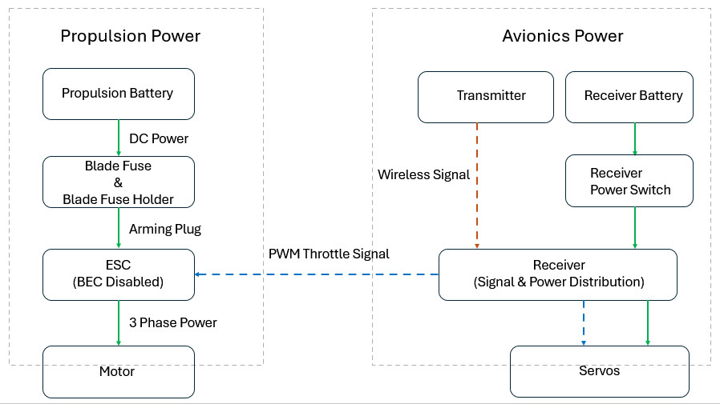

# AIAA-Design-Build-Fly-Competition-2025-2026
RC aircraft system engineering with rule-based trade studies, build, and validation

## How to Navigate This Repository
- Start with `00_project_overview/` for requirements and constraints
- Ongoing electrical design work is documented in `04_electrical_system/`

---

## Project Overview
This repository documents the system-level design, build, and test activities for an AIAA Design, Build, Fly (DBF) competition aircraft.  
The project focuses on **constraint-driven engineering decisions** under competition rules, with emphasis on propulsion, electrical systems, manufacturing, and validation.

The goal is to develop a flight-ready RC aircraft that meets strict performance and regulatory constraints (e.g., takeoff distance, energy limits, and safety requirements), while maintaining design robustness and testability.

---

## My Role and Contributions
I am responsible for **propulsion and electrical system trade studies and integration**, with direct involvement in:

- Motor–propeller–battery trade studies under DBF rules (≤100 Wh, ≤100 A)
- Electrical system architecture, power budgeting, and protection strategy
- Supporting manufacturing, assembly, and test planning activities

Ownership of each technical section is clearly indicated in the corresponding documents.
These responsibilities focus on system-level analysis and integration; detailed CAD and airframe structural design are handled by other team members.

---

## System Architecture
The aircraft is treated as an integrated system consisting of:
- Propulsion system (battery, ESC, motor, propeller)
- Electrical system (power distribution, receiver power, protection)
- Airframe geometry and landing gear constraints
- Manufacturing and assembly processes
- Ground and flight test validation

A high-level system block diagram and interface definitions are provided in the `01_system_architecture/` directory.

### System Block Diagram

Propulsion power is physically armed and disarmed via a removable XT90S anti-spark arming plug.

---

## Current Status
- Propeller diameter envelope determined from landing gear geometry
- Motor and battery architecture trade study completed (5S vs 6S comparison)
- Baseline propulsion configuration selected for testing
- Electrical system design and test planning in progress

This repository will be updated continuously as the aircraft progresses through manufacturing, integration, and test validation phases.

---

## Repository Structure

- `00_project_overview/` – Requirements, constraints, and workflow  
- `01_system_architecture/` – Block diagrams, interfaces, and risks  
- `02_electrical_system/` – Power architecture and protection design  

---

## Notes
This repository focuses on **engineering methodology and decision-making** rather than proprietary team CAD or sensitive competition details.  
All data shown is intended for educational and professional portfolio purposes.
